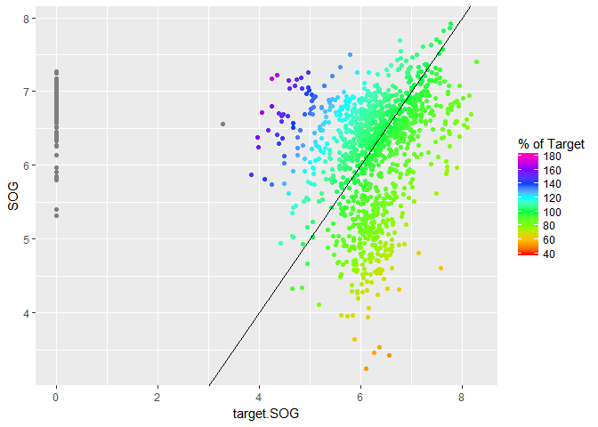
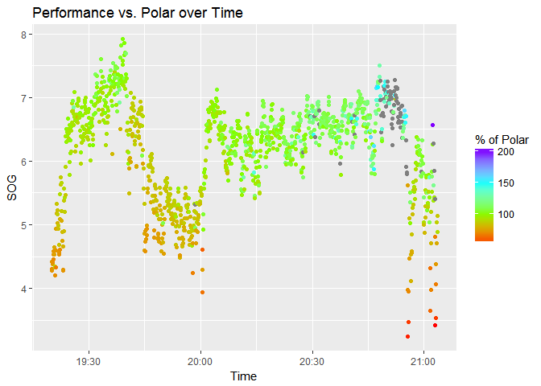

2017 Edison Boat Club Regatta
================

Zubenelgenubi USA5333 2017-08-17

route
=====

Wind Condition
==============

Grey dots are areas where the target speed could not be calculated from the polar. These are mostly areas where we were sailing above 33 degrees (ie. pinching up and sailing too high)

Distribution of Performance
---------------------------

