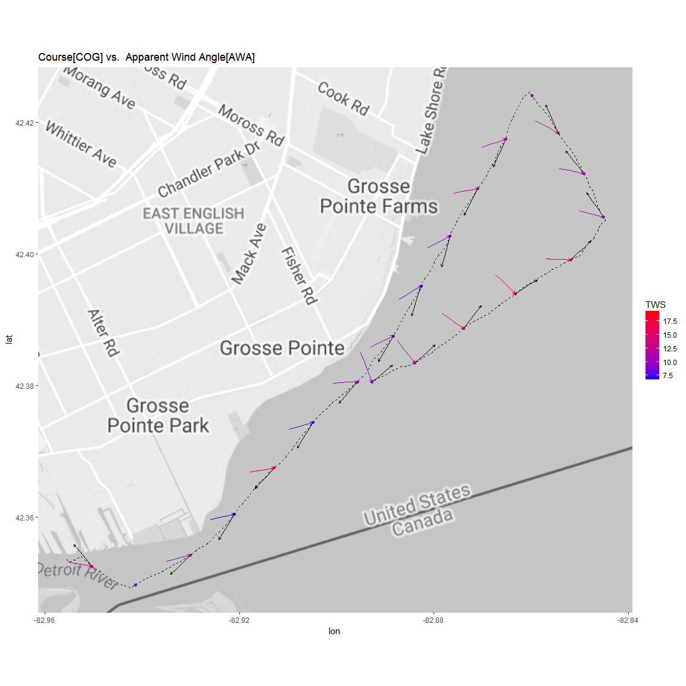
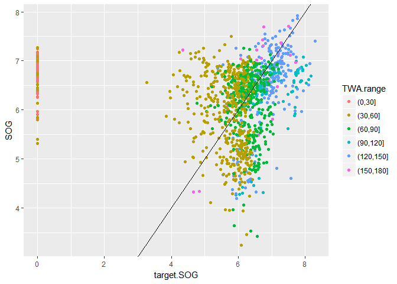

2017 Edison Boat Club Regatta
================

Zubenelgenubi USA5333 2017-08-17

``` r
load("./output/parsed_nmea_data.RData")

source("./src/funcs.R")

source("./src/loadPolars.R")

source("./src/createPerformanceData.R")
```

    ## [1] 0

``` r
perf$pol.perc <- (perf$SOG / perf$target.SOG) * 100


x <- is.na(perf$pol.perc)

sum(x)
```

    ## [1] 0

route
=====


Wind Condition
==============

    ## Scale for 'x' is already present. Adding another scale for 'x', which
    ## will replace the existing scale.

    ## Scale for 'y' is already present. Adding another scale for 'y', which
    ## will replace the existing scale.

    ## Warning: Removed 1 rows containing missing values (geom_rect).

    ## Warning: Removed 2 rows containing missing values (geom_segment).

    ## Warning: Removed 2 rows containing missing values (geom_segment).






    ## Warning: Removed 1 rows containing missing values (geom_vline).


    ## Scale for 'x' is already present. Adding another scale for 'x', which
    ## will replace the existing scale.

    ## Scale for 'y' is already present. Adding another scale for 'y', which
    ## will replace the existing scale.

    ## Warning: Removed 1 rows containing missing values (geom_rect).


Grey dots are areas where the target speed could not be calculated from the polar. These are mostly areas where we were sailing above 33 degrees (ie. pinching up and sailing too high)

By Leg of the race
==================


Distribution of Performance
---------------------------

    ## Warning: Removed 76 rows containing non-finite values (stat_bin).

    ## Warning: Removed 76 rows containing non-finite values (stat_density).


    ## Warning: Removed 76 rows containing non-finite values (stat_density).


    ## Warning: Removed 76 rows containing non-finite values (stat_bin).


